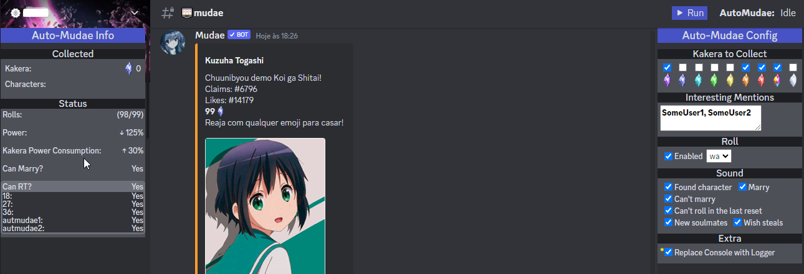

# ⚠ Discontinued: refer to [AutoMudae Extension](https://github.com/Nxve/AutoMudaeExt).

# AutoMudae 👾
Userscript for Tampermonkey that automates the use of Mudae bot in Discord.

### ⚠ Disclaimer
As it is in early development and it's initial purpose is personal use, it has some limitations for now: Chrome Browser, ptBR Mudae, slash commands only and such.

Feel free to report any issue or ask for features.

## Features
- [x] Roll
    - [x] Select roll type
    - [ ] Opt between slash and typed
- [x] React to Kakera
    - [x] Filter by kakera type
    - [ ] Filter by character key level
- [x] Claim characters
    - [x] Wished by me
    - [x] Wished by other
    - [ ] Not wished
- [x] Beep sounds for some events
- [x] Multi Client
    - [x] Use all logged accounts (Discord supports up to 4 accounts)
    - [x] Use Token List (Hard cap at 20 for now)
- [ ] Auto-use $us / $rolls when needed
- [ ] Auto-use $rt when needed

## 🛠 Installation
1. Install [Tampermonkey](https://chrome.google.com/webstore/detail/tampermonkey/dhdgffkkebhmkfjojejmpbldmpobfkfo).
2. Go to [GreasyFork Script Page](https://greasyfork.org/en/scripts/452710-automudae) and install it from there.

## Usage
Open Discord web, navigate to desired channel and refresh the page so Tampermonkey can inject the userscript at the tab.

Now you have two options at upper center of your Discord page:
- **Use Logged Users**: which uses all your Discord logged users (Up to 4)
- **Use Token List**: which will ask for a list of Discord tokens (Up to 20 for now)

You have now a **Run** button at upper right.

## TODO & Known Issues
- Add other language support
- Add config to delay claim (In case of $togglesnipe)
- Adapt to $togglebutton
- Add to total claimed kakera those received from EMERALD IV reward
- Add a way to list interesting characters/series to claim
- Improve it's performance while running on background (Chrome issue with "inactive" tabs)
